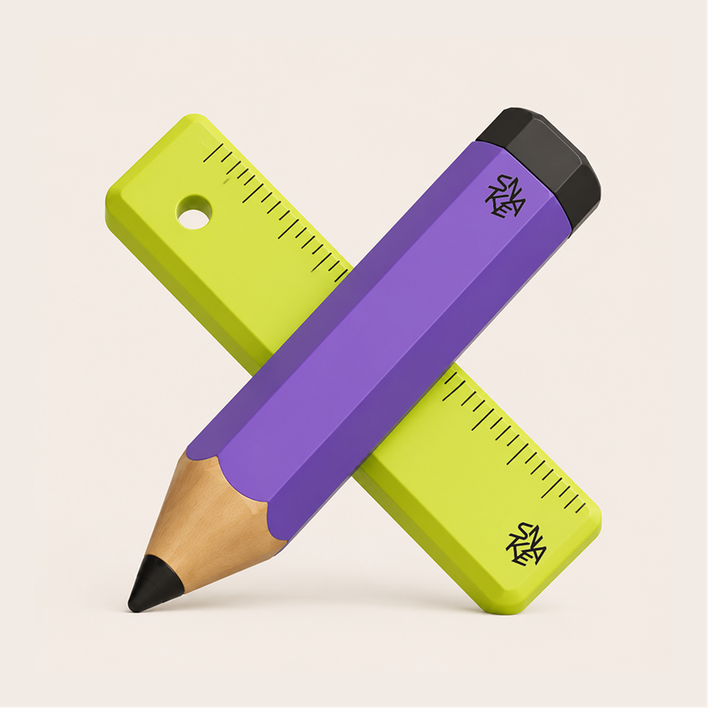

<p align="center">
  
</p>

<h1 align="center">UIForge</h1>

<p align="center">
  将品牌参考、截图、线框图、素材、文案，转化为可编辑、可复用、可审查的移动端 UI。
</p>

<p align="center">
  <a href="#中文">中文</a> · <a href="#english">English</a>
</p>

## 中文

### 简介

UIForge 是一个面向 Codex 的设计工作流插件。它可以分析混合形式的设计输入，提取品牌基因，生成三个具有明显差异的移动端首页方向，并在用户选定方案后，将完整页面重建为可编辑的 Figma 图层。

它还会生成与 Figma 节点对应的截图式 Visual Review，方便通过截图标注继续修改设计。

### 主要能力

- 自动识别品牌参考、线框图、官方素材、文案、批注和 Figma 目标。
- 提取颜色、字体、间距、圆角、阴影、图像语言和品牌使用规则。
- 分析参考图中的图文配对、组件构成、素材类型、素材位置和视觉占比，并映射到线框图现有模块。
- 根据摄影、3D、卡通、插画、黏土、拼贴或混合媒介等参考风格生成原创素材。
- 提供三个不同的首页设计方向，而不是只做简单换色。
- 锁定线框图中的原始文案、数字、操作和模块顺序，禁止未经授权的翻译或改写。
- 区分透明独立素材与完整复合图片：独立物件检查真实 Alpha；完整场景、复杂视觉表面和全幅背景允许使用角色正确的原创不透明图片。
- 将选定方向扩展为完整移动端页面，并写入 Figma。
- 使用 Auto Layout、Figma Variables、可编辑文本、矢量图标和独立图像素材。
- 生成节点映射的 Visual Review，并将截图批注对应回具体 Figma 节点。
- 通过素材、布局、变量绑定和视觉一致性检查控制交付质量。

### 工作流程

1. 一次性提供品牌参考、截图、线框图、素材、文案和 Figma 链接。
2. UIForge 自动分类输入、提取 Brand DNA，锁定线框图内容与结构，并建立参考图到线框模块的素材关系计划。
3. 生成三个具有明显差异的首页方向，并通过文案、结构、图文关系和素材角色门禁：
   - A — Product Clear
   - B — Brand Balanced
   - C — Campaign Bold
4. 选择一个主要方向。
5. UIForge 生成素材目录，并扩展剩余页面。
6. 将页面重建为可编辑的 Figma Frame。
7. 完成视觉检查并生成 Visual Review，之后可通过截图标注继续修改。

### 使用要求

- 支持插件功能的 Codex。
- 已连接并授权的 Figma 工具。
- 需要生成摄影、3D 或插画素材时，应提供可用的图像生成功能。
- 运行预览、位图透明度和门禁校验脚本时需要 Python 3 与 Pillow。

### 安装

在新电脑上，可以先下载本仓库：

```bash
git clone https://github.com/snakekwokkk/ui-forge.git
```

然后让 Codex 安装下载后的 `ui-forge` 本地插件目录。该目录中的 `.codex-plugin/plugin.json` 是插件入口。

如果不熟悉命令行，也可以直接告诉 Codex：

> 从 https://github.com/snakekwokkk/ui-forge 下载并安装 UIForge 插件。

安装或更新后，建议新建一个 Codex 任务再测试插件，以确保最新技能和工具已经载入。

### 更新

如果本地已经下载过仓库，可以获取 GitHub 上的最新版本：

```bash
git -C ui-forge pull
```

之后重新加载或安装本地插件，并新建一个 Codex 任务。也可以直接告诉 Codex：

> 从 GitHub 同步 UIForge 最新版本并更新本地插件。

### 使用示例

可以对 Codex 这样说：

> 使用 UIForge 分析这些品牌参考和移动端线框图，提取品牌基因，并生成三个首页设计方向。

> 使用 UIForge 将我选中的方向扩展成完整页面，并重建到这个 Figma 文件中。

> 使用 UIForge 为所有 Figma 页面生成 Visual Review，然后根据我的截图批注继续修改。

### 仓库结构

```text
ui-forge/
├── .codex-plugin/
│   └── plugin.json
├── assets/
│   ├── ui-forge-icon-400.png
│   └── ui-forge-logo-1024.png
└── skills/
    └── ui-forge/
        ├── SKILL.md
        ├── agents/
        ├── assets/
        ├── references/
        └── scripts/
```

### 素材与隐私

UIForge 默认将网页、截图、竞品和情绪板视为设计参考，而不是可直接复用的素材。只有用户明确说明拥有使用权限的官方素材，才应被直接用于最终设计。

---

## English

### Overview

UIForge is a Codex design workflow plugin that transforms mixed brand references, screenshots, mobile wireframes, assets, copy, annotations, and Figma links into editable mobile UI.

It extracts Brand DNA, presents three distinct home-screen directions, extends the selected direction into a complete screen set, rebuilds the result as editable Figma layers, and publishes a node-mapped screenshot Visual Review for annotation-driven revisions.

### Highlights

- Classifies mixed design inputs automatically.
- Extracts colors, typography, spacing, radii, elevation, imagery, icon, and motion rules.
- Maps reference text-media pairings, component anatomy, asset types, positions, and visual share to existing wireframe modules.
- Matches the detected photography, 3D, cartoon, illustration, clay, collage, or mixed-media language while generating original assets.
- Compares three materially different home-screen directions.
- Locks original wireframe copy, numbers, actions, hierarchy, and module order across every option.
- Requires real alpha for isolated rasters while allowing role-correct original composite scenes, complex visual surfaces, and full-bleed backgrounds.
- Builds editable Figma screens with Auto Layout, Variables, native text, vector icons, and separate image assets.
- Generates a Visual Review that maps screenshot annotations back to Figma nodes.
- Enforces preview gates for wireframe fidelity, reference-media relationships, and role-correct raster handling, plus delivery gates for asset placement, Auto Layout coverage, variable binding, and visual consistency.

### Installation

Clone the repository:

```bash
git clone https://github.com/snakekwokkk/ui-forge.git
```

Then ask Codex to install the downloaded `ui-forge` directory as a local plugin. The plugin entry point is `.codex-plugin/plugin.json`.

Start a new Codex task after installing or updating so the latest skill and tools are loaded.

Python 3 and Pillow are required for preview rendering, raster-alpha checks, and preview-gate validation.

### Updating

```bash
git -C ui-forge pull
```

Reload or reinstall the local plugin after pulling the latest version, then start a new Codex task.

### Example prompts

> Use UIForge to analyze these brand references and mobile wireframes, extract the Brand DNA, and show three home-screen directions.

> Extend my selected UIForge direction into a complete screen set and rebuild it in this Figma file.

> Generate a Visual Review for every managed Figma screen and apply my screenshot annotations back to the corresponding Figma nodes.

## Author

Created by Snake.
